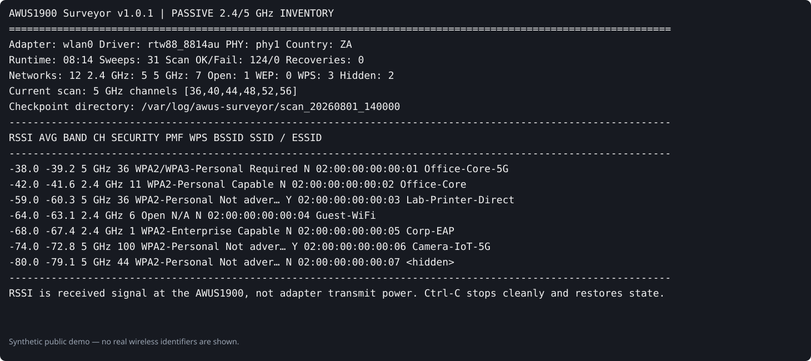

# AWUS1900 Surveyor v1.0.1

A stable, autonomous wireless-zone/AP inventory tool for an **ALFA AWUS1900** on Kali Linux.

It replaces the repetitive `airmon-ng` → monitor interface → `airodump-ng` workflow for the specific job of discovering nearby access points and retaining clean metadata. The surveyor uses passive kernel scans through `iw`/`nl80211`; it does not need a monitor interface, does not kill NetworkManager globally, and does not capture client payload traffic.



> The dashboard image is synthetic. Do not publish real survey screenshots or result files until SSIDs, BSSIDs, timestamps, and location-sensitive details have been sanitized.

This project is a natural companion to [`KampaiDiscount/kali-awus1900-deploy`](https://github.com/KampaiDiscount/kali-awus1900-deploy), which establishes and validates the AWUS1900 driver/interface state before survey work. See [Companion deployment project](docs/companion-deployment.md).

## What it records

Each BSSID is retained as an independent wireless zone/AP with:

- SSID and ESSID, hidden-state detection, and SSID history
- BSSID and local OUI vendor lookup
- 2.4 GHz or 5 GHz band, frequency, channel, and channel history
- current, best, worst, average, total spread, and quality-banded RSSI in dBm
- first seen, last seen, observation count, and kernel scan age
- Open, WEP, WPA, WPA2, WPA3, WPA2/WPA3 transition, OWE, and enterprise classification
- authentication suites, pairwise/group/group-management ciphers
- PMF state, WPS presence and lock state
- Wi-Fi generation from 802.11n through 802.11be when advertised
- BSS station count and channel utilization when advertised
- country IE, AP mode, beacon interval, security history, and concern flags

## RSSI is not AWUS1900 transmit power

The live `RSSI` column is the most recent signal level **received by the AWUS1900** from that BSSID. It does not show the adapter's transmit-power setting. `AVG` is the running average for the session and is the more stable value for comparison.

A result around `-60 dBm` is normally a healthy signal, including for a nearby 5 GHz printer or Wi-Fi Direct device. The transmitter's own power, internal antenna, chassis, orientation, obstructions, and multipath all affect the reading. At equal range, 5 GHz also has approximately 6.5 dB more free-space path loss than 2.4 GHz.

See [RSSI, dBm, and reception diagnostics](docs/rssi.md) for interpretation and hardware checks.

## Stability design

The program:

1. Auto-detects the AWUS1900 using USB ID `0bda:8813`, driver name, and USB product metadata.
2. Saves the original interface type, administrative state, NetworkManager state, and regulatory country before changing anything.
3. Releases **only the selected adapter** from NetworkManager.
4. Places the adapter in managed mode and performs passive scans over every enabled 2.4 GHz and 5 GHz frequency.
5. Splits the 5 GHz band into smaller requests to reduce Realtek driver timeouts.
6. Applies per-scan timeouts, retries, stale-cache filtering, scan aborts, interface cycling, and USB reappearance detection.
7. Atomically checkpoints all reports throughout the run, not only at shutdown.
8. Handles `Ctrl-C`, `SIGTERM`, and systemd stop cleanly, then restores the original interface and regulatory state.
9. Leaves a `/run/awus-surveyor-*.state.json` recovery file if the process is killed with `SIGKILL` or the machine loses power. The next launch restores it automatically.

A single AWUS1900 contains one radio. It therefore cannot listen on 2.4 GHz and 5 GHz at the exact same instant; it sweeps the enabled channels continuously and merges all observations into one inventory.

## Fast start

From the extracted directory:

```bash
chmod +x awus_surveyor.py run_awus_surveyor.sh
./run_awus_surveyor.sh
```

The supplied launcher temporarily uses the South African regulatory domain:

```bash
sudo ./awus_surveyor.py --country ZA
```

Press `Ctrl-C` once. The program finalizes the files and restores the adapter.

## Output

Each run creates a timestamped directory below `./awus-surveys/`:

```text
awus-surveys/scan_20260731_153000/
├── observations.jsonl
├── session.json
├── surveyor.log
├── last_raw_scan_2g.txt
├── last_raw_scan_5g.txt
├── wireless_zones.csv
├── wireless_zones.html
├── wireless_zones.json
└── wireless_zones.md
```

`wireless_zones.html` is the easiest report to inspect. It is self-contained, searchable, sortable, and works without internet access.

`wireless_zones.csv` is convenient for Excel, LibreOffice, or ingestion into another assessment workflow.

`wireless_zones.json` retains the complete structured record and session metadata.

`observations.jsonl` preserves every accepted scan observation for later signal-over-time or movement analysis.

The terminal dashboard presents the latest RSSI and running average together. CSV/JSON/HTML output retains latest, average, best, worst, sample count, quality band, and observed signal spread.

## Useful commands

Check the adapter and both bands without changing interface state:

```bash
sudo ./awus_surveyor.py --self-test
```

List all wireless interfaces and show which one looks like the AWUS1900:

```bash
sudo ./awus_surveyor.py --list-interfaces
```

Perform one complete 2.4/5 GHz sweep and exit:

```bash
sudo ./awus_surveyor.py --country ZA --once
```

Run for two hours:

```bash
sudo ./awus_surveyor.py --country ZA --duration 2h
```

Select the adapter explicitly:

```bash
sudo ./awus_surveyor.py -i wlan0 --country ZA
```

Only survey 5 GHz:

```bash
sudo ./awus_surveyor.py --country ZA --band 5
```

Retain every raw `iw` result rather than only the latest raw scan per band:

```bash
sudo ./awus_surveyor.py --country ZA --keep-raw
```

Use a fixed session name and output location:

```bash
sudo ./awus_surveyor.py \
  --country ZA \
  --output-root /mnt/recon/wireless \
  --session-name office-floor-1
```

Restore an adapter after a hard crash without starting a survey:

```bash
sudo ./awus_surveyor.py --restore-only
```

## Installation

```bash
chmod +x install.sh
sudo ./install.sh
```

This installs:

- `/usr/local/sbin/awus-surveyor`
- `/usr/local/bin/awus-survey`
- `/etc/systemd/system/awus-surveyor.service`

Then run:

```bash
awus-survey
```

The installer copies the systemd unit but deliberately does **not** enable it.

## Optional autonomous systemd service

Enable only when the AWUS1900 is a dedicated survey adapter:

```bash
sudo systemctl enable --now awus-surveyor.service
```

Watch status:

```bash
sudo systemctl status awus-surveyor.service
sudo journalctl -u awus-surveyor.service -f
```

Stop and finalize the current report:

```bash
sudo systemctl stop awus-surveyor.service
```

Service reports are stored below:

```text
/var/log/awus-surveyor/
```

## Tuning

The defaults favor stability over maximum scan speed.

```bash
sudo ./awus_surveyor.py \
  --country ZA \
  --chunk-size-5g 6 \
  --scan-timeout 25 \
  --retries 4 \
  --interval 3
```

Lower `--chunk-size-5g` if the Realtek driver times out on large 5 GHz requests. Increase it if the adapter remains stable and faster full sweeps are preferred.

The default stale-result threshold is 15 seconds. Tighten it when moving rapidly:

```bash
sudo ./awus_surveyor.py --country ZA --max-stale-ms 5000
```

## NetworkManager behavior

By default, the surveyor disconnects and marks only the selected AWUS1900 interface unmanaged. It does not run `airmon-ng check kill` and does not stop NetworkManager or `wpa_supplicant` globally.

Skip NetworkManager control only when another process already owns the lifecycle cleanly:

```bash
sudo ./awus_surveyor.py --no-networkmanager-control
```

Using the same AWUS1900 simultaneously for an internet connection and for survey scanning is not supported. Use the laptop's internal Wi-Fi or Ethernet for connectivity.

## Regulatory domain

Use the country where the adapter is physically operating. The included launcher uses `ZA` for South Africa. A manually supplied country is temporary and is restored when the survey ends.

Inspect the current domain:

```bash
sudo iw reg get
```

No 5 GHz channels usually means the current regulatory domain, driver, USB state, or RF-kill state needs attention. Run:

```bash
sudo ./awus_surveyor.py --self-test
```

## Troubleshooting

### `Device or resource busy`

The surveyor retries, requests scan abort, and cycles only the selected interface. Persistent failures generally mean another program is actively scanning or associating through the same adapter.

Check:

```bash
sudo iw dev
nmcli device status
ps aux | grep -E 'airodump|hcxdumptool|wpa_supplicant' | grep -v grep
```

### Adapter left unmanaged after a power loss or `kill -9`

```bash
sudo ./awus_surveyor.py --restore-only
```

The next normal launch also attempts stale-state restoration automatically.

### Wrong interface selected

```bash
sudo ./awus_surveyor.py --list-interfaces
sudo ./awus_surveyor.py -i wlan0 --country ZA
```

### No vendor names

Install the optional local OUI database:

```bash
sudo apt install ieee-data
```

The survey still works without it; vendor is shown as `Unknown` or `Locally administered`.

## Tests

Run the parser and report-generation tests:

```bash
python3 -m unittest -v tests/test_parser.py
```

## Development and GitHub release

Run local validation:

```bash
python3 -m py_compile awus_surveyor.py
python3 -m unittest -v tests/test_parser.py
bash -n install.sh uninstall.sh run_awus_surveyor.sh scripts/package-release.sh
```

Build release archives and checksums:

```bash
./scripts/package-release.sh
```

The repository includes GitHub Actions CI for Python 3.11, 3.12, and 3.13. See [Contributing](CONTRIBUTING.md), [Security policy](SECURITY.md), and [v1.0.1 release notes](RELEASE_NOTES_v1.0.1.md).

## Scope

This tool is an access-point inventory and radio-environment surveyor. It does not deauthenticate clients, inject frames, recover keys, or capture user payload data. Use it only where wireless observation is authorized and lawful.
